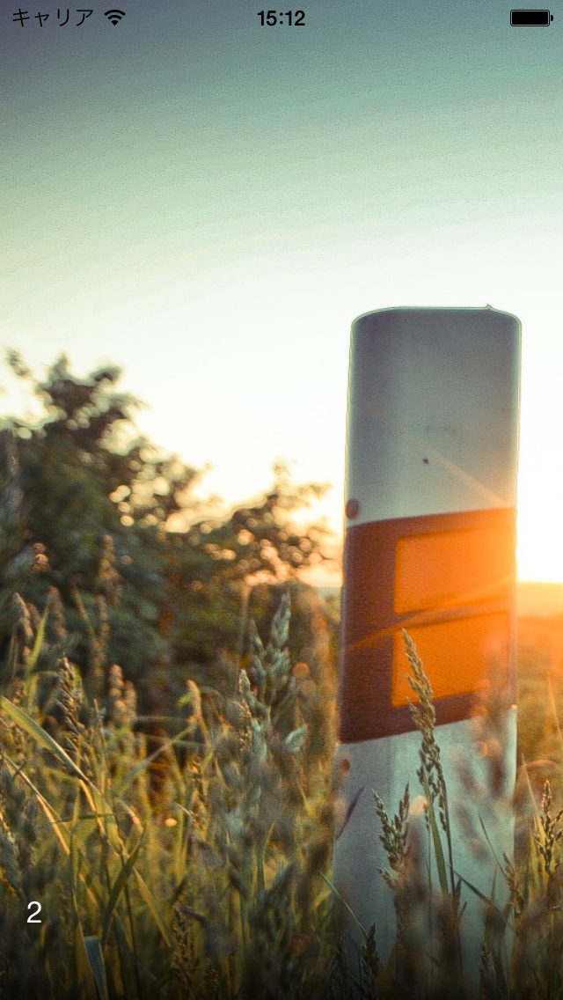
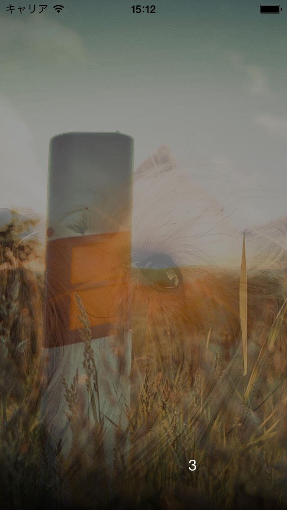

CPKenburnsSlideshowView
=======================

Using [CPKenburnsView](https://github.com/muukii0803/CPKenburnsView)

```
pod 'CPKenburnsSlideshowView'
```

Inspired by Hey Day (photo app)

## Feature!

- Infinite scroll -> OK!
- Change frame size when animating -> OK!
- Show whole image when long tap -> OK! :cactus:

## Future!

- Face detector.
- Auto photo filtering.

### I'm waiting pull request please!


@@@@@@@@@@@@@
[Play Movie](http://f.cl.ly/items/3M2G391d3K1U3g391E2C/preview.mp4)
@@@@@@@@@@@@@






CPKenburnsSlideshowView use CPKenburnsImage

Required image or imageUrl;

```
@interface CPKenburnsImage : NSObject
@property (nonatomic, strong) UIImage *image;
@property (nonatomic, strong) NSURL *imageUrl;
@property (nonatomic, assign) CGFloat latitude;
@property (nonatomic, assign) CGFloat longitude;
@property (nonatomic, strong) NSString *title;
@property (nonatomic, strong) NSString *subTitle;
@property (nonatomic, strong) NSString *locationDescription;
@property (nonatomic, strong) NSDate *date;
@end
```

```
@protocol CPKenburnsSlideshowViewDeleagte <NSObject>
@optional
- (void)slideshowView:(CPKenburnsSlideshowView *)slideshowView downloadImageUrl:(NSURL *)imageUrl completionBlock:(DownloadCompletionBlock)completionBlock;
- (void)slideshowView:(CPKenburnsSlideshowView *)slideshowView willShowKenBurnsView:(CPKenburnsView *)kenBurnsView;
@end
```

If you use imageUrl,call back
```
- (void)slideshowView:(CPKenburnsSlideshowView *)slideshowView downloadImageUrl:(NSURL *)imageUrl completionBlock:(DownloadCompletionBlock)completionBlock
{
    UIImaage *image = ~~~~;// Download image
    completionBlock(image);
}
```
